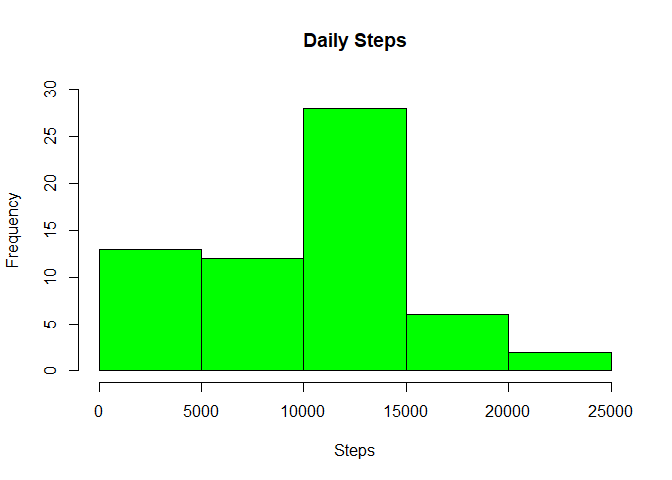
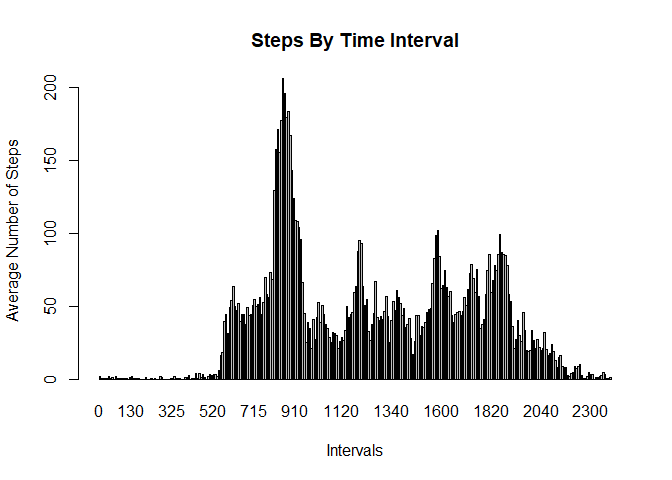
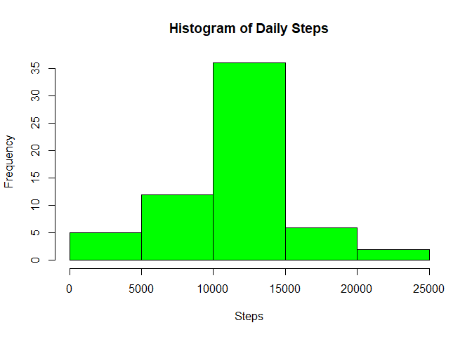
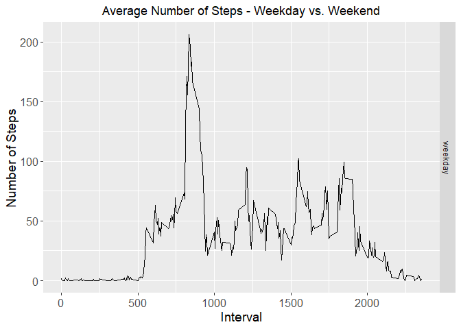

###Loading the packages

```r
library(dplyr)
```

```
## 
## 载入程辑包：'dplyr'
```

```
## The following objects are masked from 'package:stats':
## 
##     filter, lag
```

```
## The following objects are masked from 'package:base':
## 
##     intersect, setdiff, setequal, union
```

```r
library(ggplot2)
```
###Loading the data

```r
data <- read.csv("activity.csv", header=TRUE, sep=",")
```
###Subsetting the data

```r
data$date<-as.Date(data$date)
```
##What is mean total number of steps taken per day?
###Plot the histogram

```r
stepsPerDay <- data %>%
        group_by(date) %>%
        summarize(sumsteps = sum(steps, na.rm = TRUE)) 
hist(stepsPerDay$sumsteps, main = "Daily Steps", 
     col="green", xlab="Steps", ylim = c(0,30))
```

<!-- -->
###Calculate the mean and median

```r
mean <- round(mean(stepsPerDay$sumsteps),digits = 2)
median <- round(median(stepsPerDay$sumsteps),digits = 2)
print(paste("The mean is", mean))
```

```
## [1] "The mean is 9354.23"
```

```r
print(paste("The median is", median))
```

```
## [1] "The median is 10395"
```
##What is the average daily activity pattern?
###Plot

```r
stepsPerInterval <- data %>%
        group_by(interval) %>%
        summarize(meansteps = mean(steps, na.rm = TRUE)) 
barplot(stepsPerInterval$meansteps ~ stepsPerInterval$interval,
     xlab = "Intervals", ylab = "Average Number of Steps",
     main = "Steps By Time Interval")
```

<!-- -->
###Maximum number of step

```r
print(paste("Interval containing the most steps on average: ",stepsPerInterval$interval[which.max(stepsPerInterval$meansteps)]))
```

```
## [1] "Interval containing the most steps on average:  835"
```
##Imput missing values
###Number of missing values

```r
print(paste("The total number of rows with NA is: ",sum(is.na(data$steps))))
```

```
## [1] "The total number of rows with NA is:  2304"
```
###Replace NA
by replacing them with the mean
###Create new dataset

```r
newdata <- data
for (i in 1:nrow(data)){
        if(is.na(data$steps[i])){
                newdata$steps[i]<- stepsPerInterval$meansteps[newdata$interval[i] == stepsPerInterval$interval]
        }
}
```
###Plot the histogram+analysis

```r
stepsPerDay <- newdata %>%
        group_by(date) %>%
        summarize(sumsteps = sum(steps, na.rm = TRUE)) 
hist(stepsPerDay$sumsteps, main = "Histogram of Daily Steps", 
     col="green", xlab="Steps")
```

<!-- -->

```r
meanPostNA <- round(mean(stepsPerDay$sumsteps), digits = 2)
medianPostNA <- round(median(stepsPerDay$sumsteps), digits = 2)
print(paste("The mean is: ", mean(meanPostNA)))
```

```
## [1] "The mean is:  10766.19"
```

```r
print(paste("The median is: ", median(medianPostNA)))
```

```
## [1] "The median is:  10766.19"
```
According to the analysis, both mean and median becomes larger.
##Are there differences in activity patterns between weekdays and weekends?
###Create new variables

```r
activityDoW <- newdata
activityDoW$date <- as.Date(activityDoW$date)
activityDoW$day <- ifelse(weekdays(activityDoW$date) %in% c("Saturday", "Sunday"), "weekend", "weekday")
activityDoW$day <- as.factor(activityDoW$day)
```
###Plot

```r
activityWeekday <- filter(activityDoW, activityDoW$day == "weekday")
activityWeekend <- filter(activityDoW, activityDoW$day == "weekend")

activityWeekday <- activityWeekday %>%
        group_by(interval) %>%
        summarize(steps = mean(steps)) 
activityWeekday$day <- "weekday"

activityWeekend <- activityWeekend %>%
        group_by(interval) %>%
        summarize(steps = mean(steps)) 
activityWeekend$day <- "weekend"

wkdayWkend <- rbind(activityWeekday, activityWeekend)
wkdayWkend$day <- as.factor(wkdayWkend$day)


g <- ggplot (wkdayWkend, aes (interval, steps))
g + geom_line() + facet_grid (day~.) + 
        theme(axis.text = element_text(size = 12),axis.title = element_text(size = 14)) + 
        labs(y = "Number of Steps") + labs(x = "Interval") + 
        ggtitle("Average Number of Steps - Weekday vs. Weekend") + 
        theme(plot.title = element_text(hjust = 0.5))
```

<!-- -->
